#GIMP
##Transformer une image couleur en monochrome couleur. 

- Ouvrir son image sur GIMP 
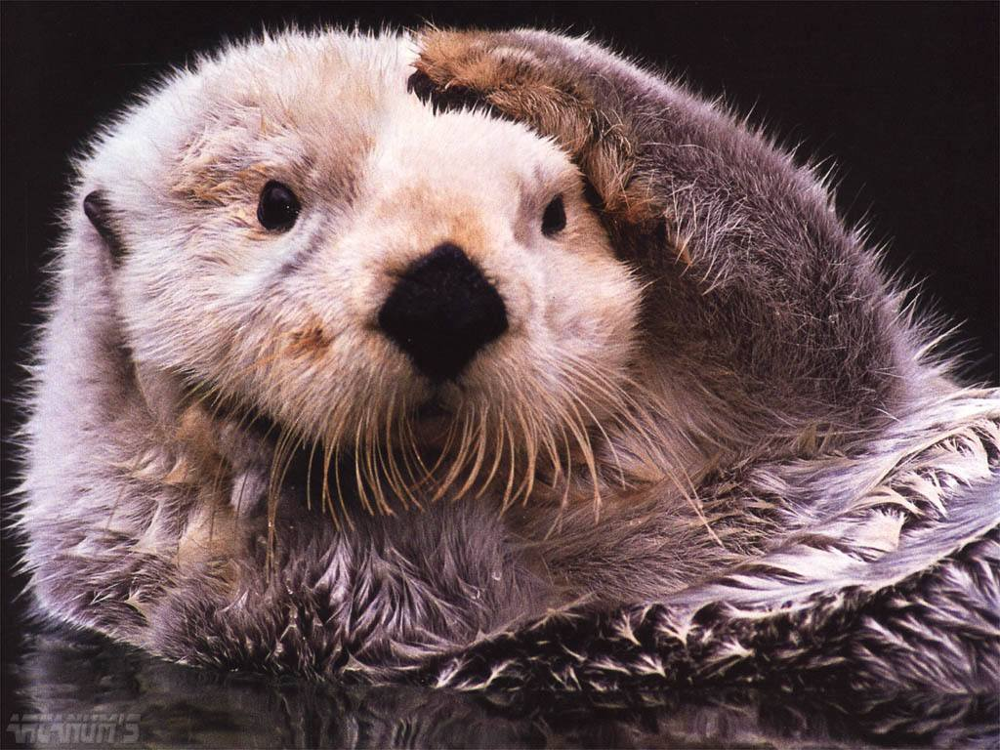
- Dupliquer l'image - **Image -> Duplicate** ou **Ctrl+D** (ou **Cmd + D**). L'image se copie dans une autre fenêtre.
-  Passer l'image en noir et blanc - **Image -> Mode -> Niveaux de gris**  (**Image -> Mode -> Grayscale**)
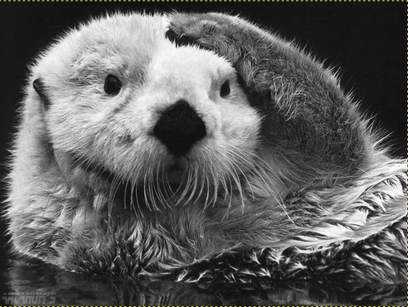  
- Repasser l'image en couleur RVB - **Image -> Mode - > RGB**  
- Dans la boîte à outil sur la gauche, double cliquez sur la couleur de premier plan et choisissez une couleur.   
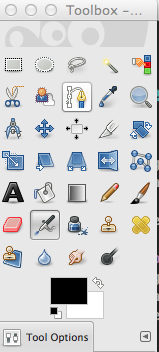  
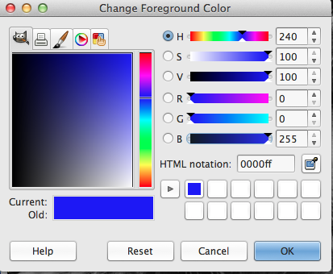 
- Pour passer l'image en monochrome bleu, rentrer ces valeurs: **R= 0, G= 0, B= 255**, les autres valeurs s'ajusteront toutes seules. Cliquer sur ok pour valider la couleur.
- Ouvrir la fenêtre de gestion des calques (**Ctrl + L** ou **Cmd + L**). Cliquer sur l'icone page blanche en bas à gauche de cette fenêtre, il vous permet de créer un nouveau calque.  
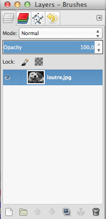 
- Donner un nom à votre nouveau claque (Blue par exemple, comme j'ai choisi la couleur bleu), et dans "Layer Fill Type", cocher **"Foreground color"**, ce qui va remplir votre calque de la couleur que vous avez choisi dans l'étape précédente. Cliquer sur Ok.   
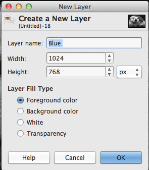 
- Vous ne devriez plus rien voir à part un fond de la couleur que vous avez choisi, qui a recouvert votre image.   

- Cliquer droit sur votre calque que vous venez de créer (Blue pour moi), et cliquer sur **Add Layer Mask**.  
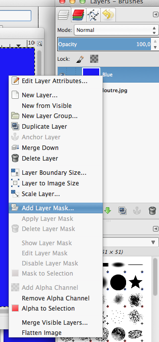
- Une fenêtre s'ouvre, choisir **"White (Full Opacity)"**   
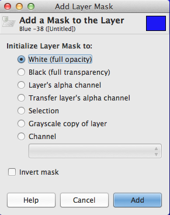
- Dans la fenêtre de calque, cliquer (sélectionner) le calque sur lequel il y a votre image de base. Cliquer dans la fenêtre de votre image, puis selctionner tout et copier (**Ctrl+A puis Ctrl+C** ou **Cmd+A puis Cmd+C**). Dans la fenêtre des calques, cliquer sur le carré noir à côté de votre calque de couleur (Blue dans mon exemple). Puis cliquer dans la fenêtre et coller (**Ctrl+V** ou **Cmd+V**). Vous devriez obtenir ça.    
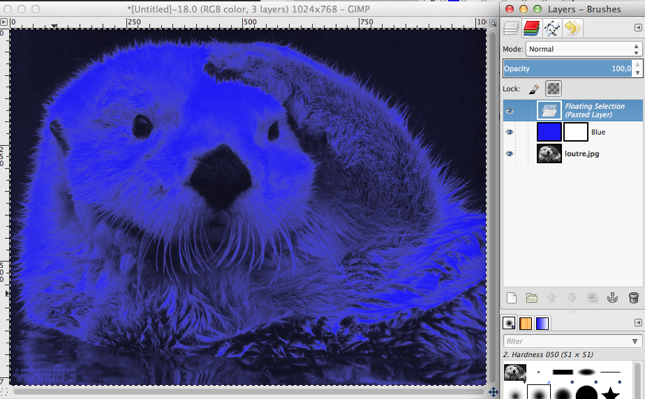
- Dans la fenêtre de calques, cliquer sur le bouton **Ancre** qui se trouve en bas à droite, à côté du bouton poubelle. Cela permet d'ancrer l'image collée dans le *Layer Mask*.  
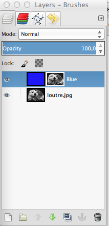
- Inverser les couleurs: **Colors > Invert**  
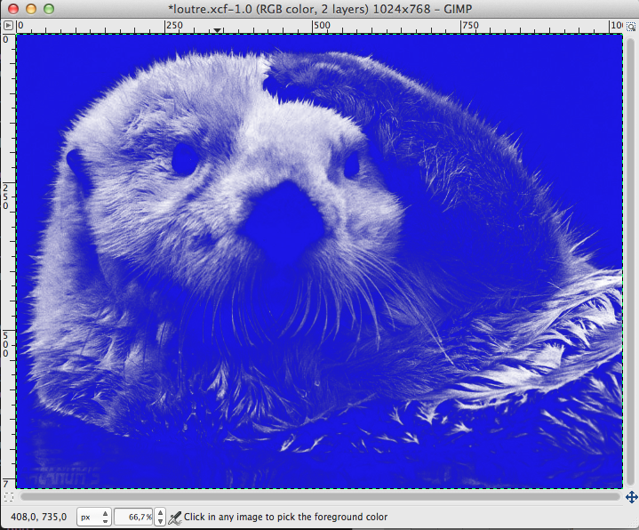
- Dans la fenêtre de Calques, **changer le Mode en "Color"** (Un menu déroulant permet de changer le mode, il se trouve en haut de la fenêtre de calque). Le rendu constitue votre image de base. Enregistrer votre document GIMP.  
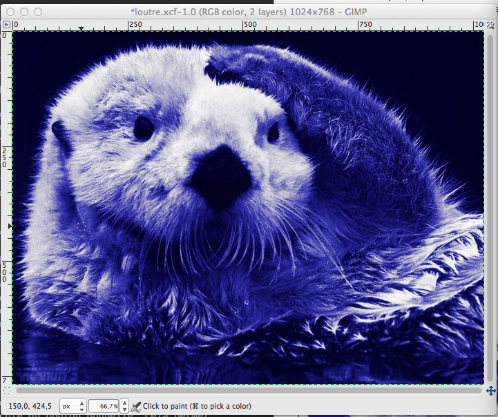
- Une fois que vous avez votre image de base, vous pouvez affiner votre image en jouant sur:
	- **Colors>Color Balance**
	- **Colors>Hue-Saturation**
	- **Colors>Levels**
	- **Colors>Curves**  
Vous pouvez dupliquer votre image de base (**Ctrl+D** ou **Cmd+D**) et faire les modifications précédentes dessus, pour garder telle quelle votre image de base.  
L'image de base à droite et mon image terminée à gauche.
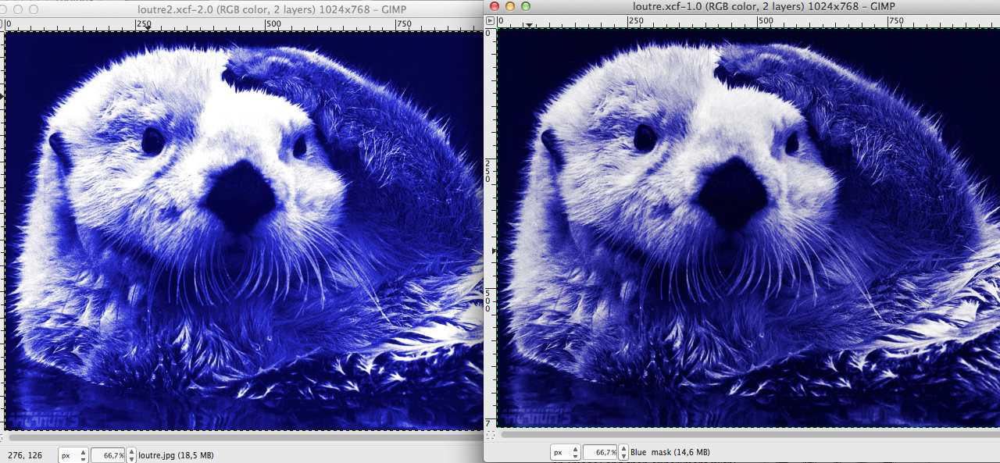
